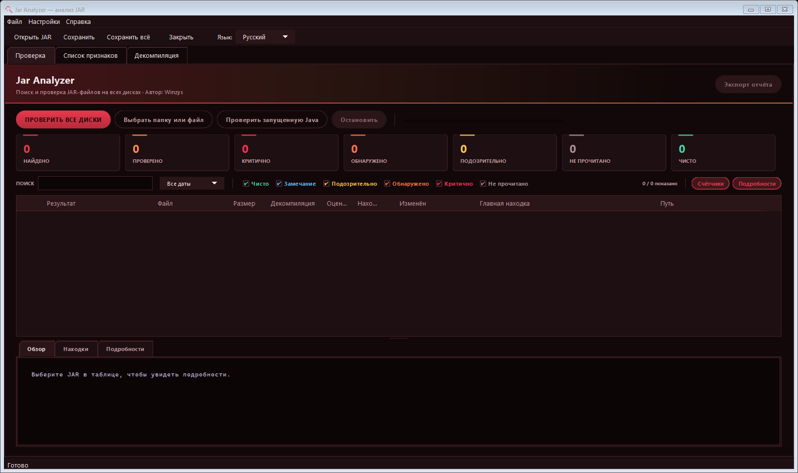
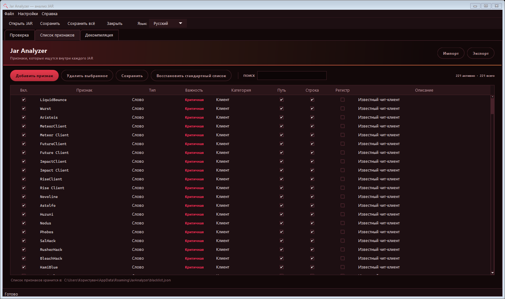

# Jar Analyzer на русском

Jar Analyzer помогает проверять JAR-файлы Minecraft: ищет известные признаки чит-клиентов, показывает совпадения внутри архивов и отмечает файлы, которые трудно разобрать. Это русская версия [программы Winzys](https://github.com/winzysss/JarAnalyzer). Переведены интерфейс и пояснения к результатам; алгоритмы обнаружения оставлены как в оригинале.

**[Скачать JarAnalyzer-RU.exe для Windows](https://github.com/Kafkinse/JarScanner/releases/download/v2.1.0-ru2/JarAnalyzer-RU.exe)** · [Открыть страницу релиза](https://github.com/Kafkinse/JarScanner/releases/tag/v2.1.0-ru2)

## Быстрый старт

1. Скачайте `JarAnalyzer-RU.exe` по ссылке выше.
2. Запустите файл и подтвердите запрос Windows на права администратора. Для этой сборки подтверждение требуется при запуске.
3. В открывшемся окне нажмите **«Выбрать папку или файл»**, если хотите проверить конкретный мод или папку с модами. Для поиска по компьютеру нажмите **«ПРОВЕРИТЬ ВСЕ ДИСКИ»**.
4. После проверки выберите интересующий JAR в таблице. Внизу окна откройте **«Находки»** и **«Подробности»**, чтобы увидеть причины результата. Двойной щелчок по строке откроет файл во вкладке декомпиляции.
5. При необходимости нажмите **«Экспорт отчёта»** и выберите папку для сохранения.

Устанавливать Java отдельно не нужно: она включена в `.exe`. При первом запуске программа распаковывается в `%LOCALAPPDATA%\JarAnalyzerRU\2.1.0-ru2\`.



## Режимы проверки

| Кнопка | Что делает |
| --- | --- |
| **ПРОВЕРИТЬ ВСЕ ДИСКИ** | Ищет JAR-файлы на доступных дисках, включая архивы с изменённым расширением и файлы в корзине. |
| **Выбрать папку или файл** | Проверяет указанный JAR или папку. Подходит для быстрой проверки `mods`. |
| **Проверить запущенную Java** | Анализирует JAR-файлы, связанные с работающими Java-процессами. |

На вкладке **«Список признаков»** можно посмотреть и отредактировать проверяемые признаки. Изменения списка влияют на последующие результаты, поэтому перед сравнением отчётов убедитесь, что используется одинаковый список.



## Как читать результат

| Результат | Значение |
| --- | --- |
| **Чисто** | Архив прочитан, совпадений с активным списком признаков нет. |
| **Замечание** | Найден слабый или общий признак; изучите контекст. |
| **Подозрительно** | Архив обфусцирован, зашифрован или его не удалось полноценно разобрать. |
| **Обнаружено** | Найдено совпадение со списком признаков. Посмотрите, в каком файле и рядом с каким текстом оно возникло. |
| **Критично** | Есть совпадение, а архив одновременно сопротивляется анализу. |
| **Не прочитано** | Содержимое архива не удалось проверить; делать вывод о нём по одному этому результату нельзя. |

**Совпадение не доказывает использование чита.** Обычные моды тоже могут содержать похожие названия, обфускацию и нативные библиотеки. Оценивайте конкретные находки, путь к файлу и контекст. Отсутствие находок также не гарантирует, что компьютер полностью чист: статический анализ не видит все действия программы во время работы.

## Отчёт

Кнопка **«Экспорт отчёта»** сохраняет три файла в выбранную папку:

| Файл | Содержимое |
| --- | --- |
| `wjf-report.html` | Отчёт для просмотра в браузере. |
| `wjf-report.txt` | Текстовый отчёт с находками. |
| `wjf-report.json` | Данные для дальнейшей обработки. |

Отчёт содержит сведения о проверенных файлах, включая пути и хеши. Перед отправкой другому человеку просмотрите его содержимое.

## Язык и совместимость

Русский выбран по умолчанию при первом запуске. Переключить язык можно на верхней панели или через **«Настройки» → «Язык»**. Доступны также английский и турецкий.

Сборка рассчитана на **64-разрядную Windows**. Файл `.exe` не имеет цифровой подписи, поэтому Windows может показать предупреждение. Скачивайте его со страницы релиза и сверяйте SHA-256:

```text
863964355ce496766ce4ecafce046b5bebe68d03d182d576b9261288f96c446c
```

Проверка суммы в PowerShell:

```powershell
Get-FileHash .\JarAnalyzer-RU.exe -Algorithm SHA256
```

## Сборка из исходного кода

Если хотите собрать программу сами, используйте Windows и JDK 21. Библиотеки находятся в папке `lib`.

```powershell
.\build.ps1 -Package -SingleFile
```

Готовая сборка появится в `dist\JarAnalyzer.exe`; для релиза она переименована в `JarAnalyzer-RU.exe`. Команда создаёт единый файл со встроенной средой Java. Подробное описание оригинальной программы на английском и турецком сохранено в [README.en-tr.md](README.en-tr.md).

## Автор и лицензия

Оригинальная программа создана [Winzys](https://github.com/winzysss/JarAnalyzer). Права на исходный код и условия использования указаны в [LICENSE](LICENSE): для изменения и распространения требуется предварительное письменное разрешение автора. Эта локализация опубликована по разрешению автора, о котором сообщил владелец репозитория. Лицензии включённых библиотек перечислены в [THIRD-PARTY.md](THIRD-PARTY.md).
